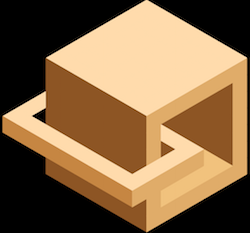
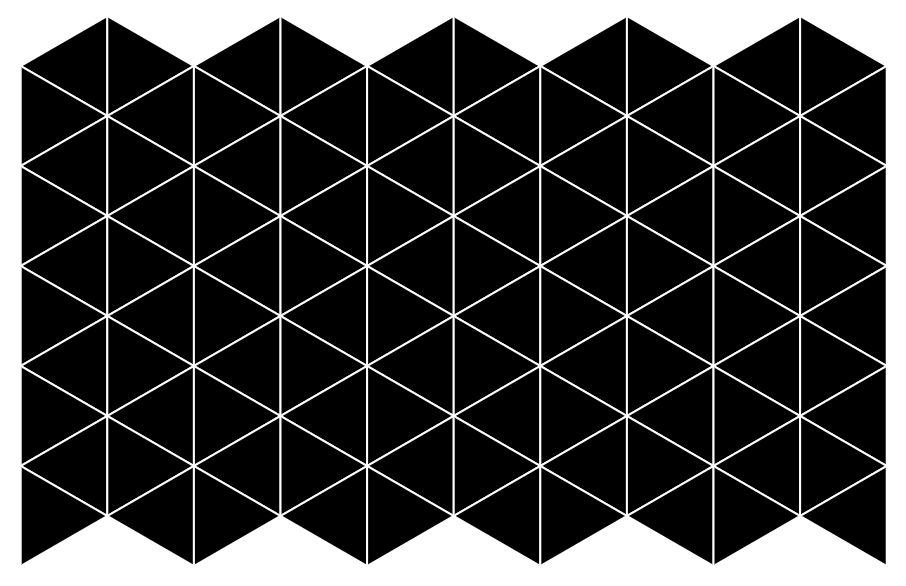
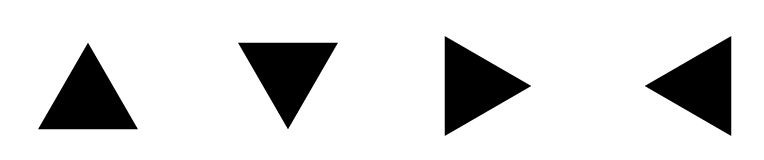

# react-triangle
draw svg triangle grid with react



## Install

`$ npm install react-triangle`

## Usage

```javascript
import React, {Component} from "react";
import ReactDom from "react-dom";
import Triangle, {TriangleGenerator} from "react-triangle";

class Triangles extends Component {
    constructor(props) {
        super(props);
        this.generator = new TriangleGenerator({
            x: 0,
            y: 0,
            size: 50,
            direction: "left"
        });
    }

    render() {
        const triangles = Array.from(Array(10).keys()).map((i) => {
            return Array.from(Array(10).keys()).map((j) => {
                const triangleProps = this.generator.byCoord(i, j);
                return this.triangle(triangleProps);
            });
        });
        return (<svg>{triangles}</svg>);
    }

    triangle(props) {
        return (
            <Triangle
                x={props.x}
                y={props.y}
                size={props.size}
                direction={props.direction}
                key={`x${props.x}y${props.y}`}
                style={{strokeWidth: "1px", stroke: "white"}}
            />
        );
    }
}

ReactDom.render(<Triangles />, document.getElementById("example"));
```



## Api

### react component class `Triangle` (default exported)

triangle react component. `<Triangle x={10} y={50} size={30} direction="up"/>`

#### component props `x`

PropTypes.number

Triangle position of x (px).

#### component props `y`

PropTypes.number

Triangle position of y (px).

#### component props `size`

PropTypes.number

Triangle side length (px).

#### component props `direction`

PropTypes.oneOf(["up", "down", "left", "right"])

Triangle direction.



### class `TriangleGenerator` (named exported)

Helper class of Triangle class.

#### constructor arguments

Canonical triangle props object. `new TriangleGenerator({x:0, y:0, size:10, direction:"right"})`

Those of `x, y, size, direction` props used as variables. Other props values are passed through.

#### instance method `generator.byCoord(x, y)`

Generate props of Triangle class by coordinates x and y. `generator.byCoord(10, 20)`
